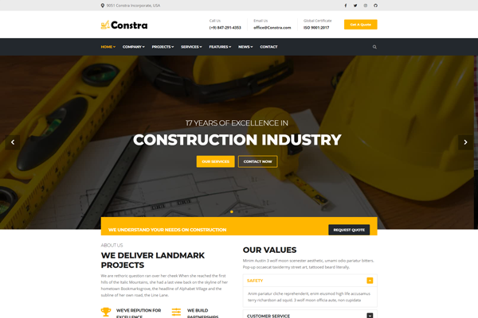
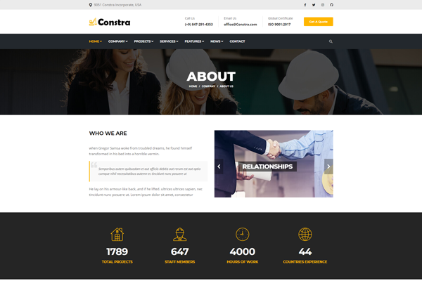
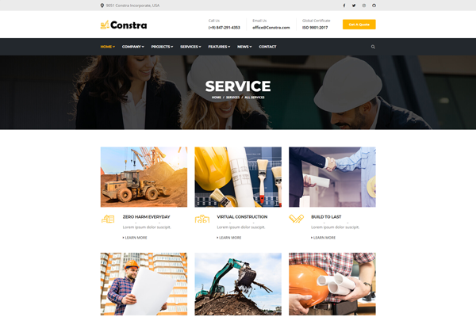
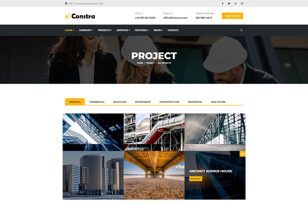
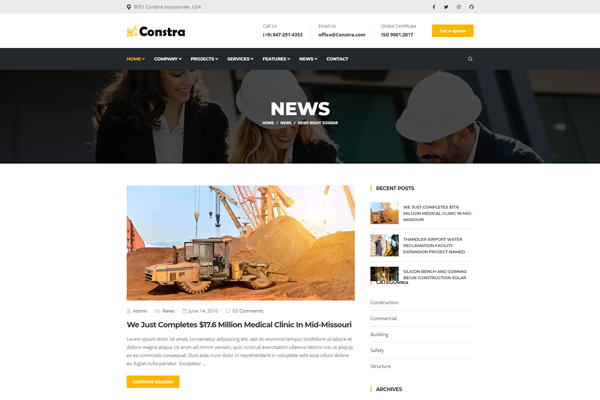

# Constra - Free bootstrap construction template

Constra is a theme for professional builders, construction or even industrial production companies with a focus on presenting the team, current and recent projects. Responsive development of the layouts makes the theme look good on any modern device.

<!-- demo -->
## Example Site

| [](https://demo.themefisher.com/constra/) | [](https://demo.themefisher.com/constra/index-2.html) | [](https://demo.themefisher.com/constra/about.html) |
|:---:|:---:|:---:|
| **Homepage 1**  | **Homepage 2**  | **About**  |
| [](https://demo.themefisher.com/constra/services.html) | [](https://demo.themefisher.com/constra/projects.html) | [](https://demo.themefisher.com/constra/news-right-sidebar.html) |
| **Service** | **Project** | **News** |

👉🏻[View Live Preview](https://demo.themefisher.com/constra/)

<!-- resources -->
## Pages

* **Homepage 1**
* **Homepage 2**
* **About**
* **Services**
* **Service Details**
* **Projects**
* **Projects Details**
* **Pricing**
* **Team**
* **Testimonials**
* **News Left Sidebar**
* **News Right Sidebar**
* **News Details**
* **FAQ**
* **404**
* **Typography**
* **Contact**

<!-- download -->
## Download And installation

Download this template from [Github](https://github.com/themefisher/constra/archive/main.zip)

<!-- installation -->
### Basic Usages

After downloading the template, you can simply edit the HTML and CSS files from the `theme` folder. To preview the changes you make to the code, you can open the index.html file in your web browser.

### Advanced Usage

For advanced usage, you have some prerequisites to install. Then you can run it on your localhost. You can view the package.json file to see which scripts are included.

#### Install prerequisites (once for a machine)

* **Node Installation:** [Install node js](https://nodejs.org/en/download/)
* **Gulp Installation:** Install gulp globally from your terminal

```
npm install --global gulp-cli
```

Or visit the original [Gulp docs](https://gulpjs.com/docs/en/getting-started/quick-start)

#### Local setup

After successfully installing those dependencies, open this theme with any IDE [[VS Code](https://code.visualstudio.com/) recommended], and then open the internal terminal of IDM [vs code shortcut <code>ctrl/cmd+\`</code>]

* Install dependencies

```
npm install
```

* Run locally

```
npm run dev
```

After that, it will open up a preview of the template in your default browser, watch for changes to source files, and live reload the browser when changes are saved.

#### Production Build

After finishing all the customization, you can create a production build by running this command.

```
npm run build
```

Now you get a `theme` folder that has all the changes you have made. you can use this folder as your main theme.

👉🏻 [visit documentation](https://docs.themefisher.com/constra/)

<!-- reporting issue -->
## Reporting Issues

We use GitHub Issues as the official bug tracker for the Constra Template. Please Search [existing issues](https://github.com/themefisher/Constra-Bootstrap-Construction-Template/issues). It’s possible someone has already reported the same problem.
If your problem or idea has not been addressed yet, feel free to [open a new issue](https://github.com/themefisher/Constra-Bootstrap-Construction-Template/issues).

<!-- support -->
## Technical Support or Questions (Paid)

If you have questions or need help integrating the product please [contact us](mailto:mehedi@themefisher.com) instead of opening an issue.

<!-- licence -->
## License

Copyright (c) 2016 - Present, Designed & Developed by [Themefisher](https://themefisher.com)

**Code License:** Released under the [MIT](https://github.com/themefisher/constra/blob/main/LICENSE) license.

**Image license:** The images are only for demonstration purposes. They have their license, we don't have permission to share those images.

<!-- resources -->
## Resources

Some third-party plugins that we used to build this template. Please check their licenses.

* **Bootstrap v4.5**: <https://getbootstrap.com/docs/4.5/getting-started/introduction/>
* **Jquery v3.5.1**: <https://jquery.com/download/>
* **Google Fonts**: <http://fonts.google.com/>
* **Font Awesome Free**: <https://fontawesome.com/>
* **Animate CSS**: <https://animate.style/>
* **Colorbox**: <https://www.jacklmoore.com/colorbox/>
* **Slick**: <https://kenwheeler.github.io/slick/>
* **Shuffle**: <https://vestride.github.io/Shuffle/>
